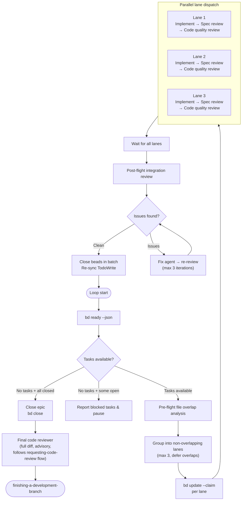
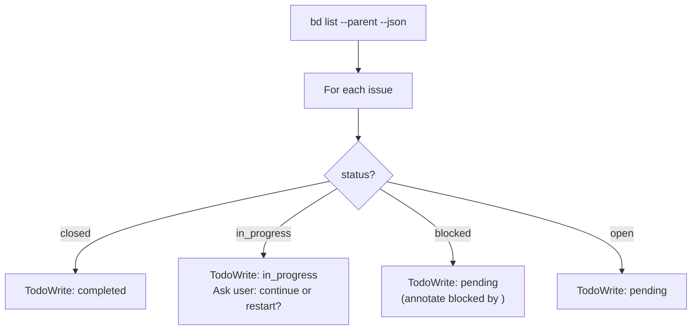

# Design: dispatch-parallel-bead-agents Skill

**Date:** 2026-03-23
**Status:** Draft
**Approach:** New standalone skill alongside existing sequential beads-driven-development

## Problem

beads-driven-development processes tasks one at a time: pick a task, implement, spec review, code quality review, close, repeat. When `bd ready` returns multiple independent tasks that touch different files, this leaves throughput on the table. The beads dependency graph already identifies which tasks can safely run concurrently.

## Design Decisions

1. **Review strategy:** Full pipeline per agent. Each parallel lane runs implement → spec review → code quality review independently.
2. **Conflict resolution:** Both pre-flight file overlap check (avoid obvious collisions) and post-flight integration review (catch semantic conflicts).
3. **Parallelism limit:** Fixed cap of 3 concurrent lanes. Simple and predictable.

## Architecture

### Core Loop

Graceful degradation: when only 1 task is ready or all tasks share files, behavior is identical to sequential beads-driven-development.

### Pre-flight File Overlap Analysis

Before dispatching a batch, the orchestrator extracts target files from each task's spec (the plan file text).

**Grouping algorithm:**

1. For each ready task, extract its file set from the plan spec.
2. Greedily assign tasks to lanes: a task goes to lane N if it shares no files with any task already in lane N.
3. If a task overlaps all existing lanes, or MAX_LANES (3) is reached, defer the task to the next batch.
4. If no file info is available in the spec, treat the task as overlapping with everything (forces sequential).

**File extraction heuristic:** Look for file paths in the task spec text (patterns like `src/...`, `lib/...`, explicit "Files:" sections). If the plan uses a structured format with file lists per task, use those directly. If ambiguous, fall back to sequential for that task.

### Task Spec Provisioning

Before dispatching lanes, the orchestrator resolves each task's full text:

1. Check if the bead ID exists in the task-number-to-bead-id mapping (from plan conversion).
2. **If mapped:** Read the full task spec from the plan file using the task-number reference. Provide the complete text to the lane subagent.
3. **If not mapped (ad-hoc task):** Use the bead description directly as the task spec.

The orchestrator never makes lane subagents read the plan file. All task text is provided inline in the lane prompt.

### Lane Execution

Each lane is dispatched as a single Task subagent that runs the three-stage pipeline linearly within one prompt session. The lane subagent acts as a mini-orchestrator: it implements, then self-reviews against the spec, then reviews code quality — all within a single agent session. This is architecturally different from the sequential skill where the main orchestrator dispatches three separate subagents. Here, collapsing into one agent per lane enables true parallel execution.

The lane prompt provides:
- Full task spec text (from provisioning above)
- Context about where the task fits in the broader plan
- The review criteria from `spec-reviewer-prompt.md` and `code-quality-reviewer-prompt.md`
- Instructions to run all three stages sequentially within the session

**NEEDS_CONTEXT handling within lanes:** When the implementer phase encounters ambiguity:
- **Attempt 1-2:** The lane subagent attempts to self-resolve by reading relevant source files, tests, and documentation in the codebase. It has full file system access and should use it.
- **Attempt 3:** If still unresolved, the lane returns NEEDS_CONTEXT to the orchestrator with a description of what it needs.
- The orchestrator provides the requested context and re-dispatches the lane (resuming the same task, not starting over).
- If NEEDS_CONTEXT returns 3 times from the orchestrator level, the lane is marked FAILED and escalated to the user.

The lane subagent returns a structured report:
- **Status:** DONE / BLOCKED / FAILED / NEEDS_CONTEXT
- **Files changed:** List of all modified/created files
- **Test results:** Pass/fail summary
- **Review summaries:** Spec review verdict, code quality verdict
- **Concerns:** Any issues noted during implementation or review

If a lane returns BLOCKED, the orchestrator updates the bead (`bd update <id> --status blocked --reason "..."`) and proceeds with remaining lanes. If a lane returns FAILED (review loops exhausted), the orchestrator escalates to the user before continuing.

### Commit Coordination

Multiple lanes commit to the same branch concurrently. This is safe because pre-flight file overlap analysis ensures lanes modify non-overlapping file sets. Each lane commits its own changes independently. **Lane subagents must only stage their own files by path (`git add <specific-files>`), never use `git add .`** — since lanes share a working directory, `git add .` could stage another lane's uncommitted changes. If pre-flight analysis cannot confirm non-overlap (e.g., missing file info in spec), the task is forced sequential, eliminating concurrent commit risk.

### Post-flight Integration Review

After all lanes in a batch complete successfully, a new subagent checks for cross-lane issues:

- **Semantic conflicts:** Both tasks modified related interfaces in incompatible ways.
- **Import/dependency issues:** Task A added a dependency Task B removed.
- **Duplicate code:** Both tasks implemented similar utilities independently.
- **Test interference:** Tests from one lane break assumptions of another.

**Input to integration reviewer:**
- List of all files changed across all lanes
- Summary of what each lane implemented
- The task specs for all lanes in the batch

**Resolution flow:**
1. If no issues found → proceed to close beads.
2. If issues found → dispatch fix agent with specific conflict descriptions → integration reviewer re-checks → max 3 iterations → escalate to user.

### Dual Tracking Protocol

Every state transition updates both beads and TodoWrite. Identical to beads-driven-development except batch-aware:

| Event | Beads | TodoWrite |
|---|---|---|
| Batch dispatched | `bd update <id> --claim` per lane | Mark each in_progress |
| Lane returns BLOCKED | `bd update <id> --status blocked` | Mark pending + reason |
| Lane passes all reviews | (hold until integration review) | (hold) |
| Integration review passes | `bd close <id>` per lane | Mark each completed |
| All tasks closed | `bd close <epic-id> --reason "All tasks completed"` | All completed |
| Final code review passes | (epic already closed) | (all already completed) |

If beads and TodoWrite disagree, beads wins. TodoWrite re-syncs from `bd list` after each batch.

### Model Selection

Same strategy as beads-driven-development / subagent-driven-development:
- **Cheap/fast models:** Mechanical tasks (isolated functions, clear specs, 1-2 files).
- **Standard models:** Integration tasks (multi-file, pattern matching).
- **Most capable models:** Architecture, design, review tasks, integration review.

## Initialization

Before entering the execution loop, sync session state with beads (same as beads-driven-development):

## Error Handling

- **`bd ready` error:** Retry once, then report and pause.
- **`bd close` error:** Log warning, continue (code is done; beads state can be fixed manually).
- **Lane BLOCKED:** Update bead, continue with remaining lanes in batch.
- **Lane FAILED (review exhausted):** Escalate to user with reviewer concerns before proceeding.
- **Integration review exhausted (3 iterations):** Escalate to user with conflict descriptions.
- **Lane NEEDS_CONTEXT:** Orchestrator provides requested context and re-dispatches the lane (max 3 round-trips). If still unresolved, lane marked FAILED and escalated to user with full context request history.
- Tracking failures never block code execution. Code failures always stop the lane (not the whole batch).

## Red Flags

**Never:**
- Skip reviews (spec compliance OR code quality) in any lane.
- Skip integration review after a multi-lane batch.
- Proceed with unfixed integration issues.
- Dispatch more than MAX_LANES concurrent lanes.
- Make subagents read the plan file (provide full text instead).
- Skip re-review after implementer fixes within a lane.
- Start code quality review before spec compliance passes within a lane.
- Dispatch a new batch while a previous batch's integration review has open issues.
- Override pre-flight overlap analysis to force parallel execution.

## Relationship to Existing Skills

- **beads-driven-development:** Sequential sibling. Use when tasks are heavily interdependent or when you want maximum review rigor with zero conflict risk.
- **dispatching-parallel-agents:** Inspiration for the parallel dispatch pattern, but that skill is for independent investigations (single-stage). This skill runs full three-stage pipelines per lane.
- **subagent-driven-development:** Shares prompt templates (implementer, spec-reviewer, code-quality-reviewer). This skill doesn't replace it; it uses the same building blocks.

## When to Use This Skill vs beads-driven-development

Use **dispatch-parallel-bead-agents** when:
- Multiple independent tasks are available in `bd ready`.
- Tasks touch different files/subsystems.
- Throughput matters more than minimal token usage.

Use **beads-driven-development** (sequential) when:
- Tasks are heavily interdependent (most overlap files).
- You want simpler orchestration with zero conflict risk.
- Only 1-2 tasks are ready at a time anyway.
