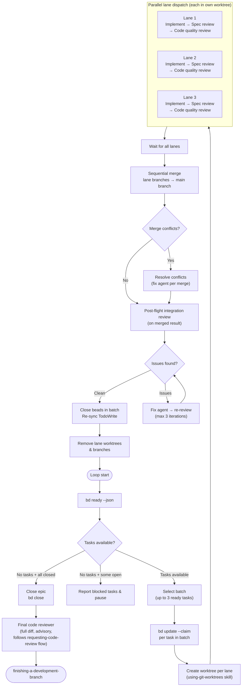
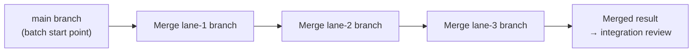
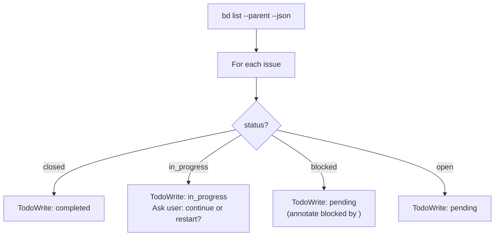

# Design: dispatch-parallel-bead-agents Skill

**Date:** 2026-03-23
**Status:** Draft
**Approach:** New standalone skill alongside existing sequential beads-driven-development

## Problem

beads-driven-development processes tasks one at a time: pick a task, implement, spec review, code quality review, close, repeat. When `bd ready` returns multiple independent tasks, this leaves throughput on the table. The beads dependency graph already identifies which tasks can safely run concurrently.

Running parallel agents in the same worktree is inherently fragile — concurrent git operations race, `git add .` can stage another agent's files, and even non-overlapping file edits share a single index. Git worktrees solve this at the filesystem level: each lane gets its own isolated working directory and branch.

## Design Decisions

1. **Review strategy:** Full pipeline per agent. Each parallel lane runs implement → spec review → code quality review independently.
2. **Isolation:** Each lane gets its own git worktree and branch. No shared working directory, no concurrent git operations on the same index.
3. **Integration:** After all lanes complete, sequential merge of lane branches back to the main branch, followed by an integration review.
4. **Parallelism limit:** Fixed cap of 3 concurrent lanes. Simple and predictable.

## Architecture

### Core Loop



Graceful degradation: when only 1 task is ready, a single worktree is created and behavior is equivalent to sequential beads-driven-development.

### Worktree Lifecycle

Each lane gets an isolated worktree following the `using-git-worktrees` skill conventions:

**Setup (before lane dispatch):**

1. Determine worktree directory (follow using-git-worktrees priority: existing `.worktrees/` → `worktrees/` → CLAUDE.md preference → ask user).
2. Verify directory is gitignored (fix if not).
3. Create one worktree per lane with a dedicated branch:
   ```bash
   git worktree add <worktree-dir>/lane-<N>-<bead-id> -b lane/<bead-id>
   ```
4. Run project setup in each worktree (auto-detect: `npm install`, `cargo build`, etc.).
5. Verify clean baseline (tests pass) before dispatching the lane subagent.

**During execution:** Each lane subagent works entirely within its own worktree. It commits freely to its own branch — no coordination needed with other lanes.

**After all lanes complete — sequential merge:**



1. From the main worktree, merge each lane branch sequentially:
   ```bash
   git merge lane/<bead-id-1> --no-ff -m "Merge lane 1: <task summary>"
   git merge lane/<bead-id-2> --no-ff -m "Merge lane 2: <task summary>"
   git merge lane/<bead-id-3> --no-ff -m "Merge lane 3: <task summary>"
   ```
2. If a merge produces conflicts, dispatch a conflict resolution agent with the conflict markers and both task specs. Resolve, commit, continue to next merge.
3. After all merges complete, run integration review on the merged result.

**Cleanup (after integration review passes):**

```bash
git worktree remove <worktree-dir>/lane-<N>-<bead-id>
git branch -d lane/<bead-id>
```

### Batch Selection

Batch selection is simple with worktree isolation — no file overlap analysis needed:

1. Call `bd ready --json` to get all unblocked tasks.
2. Take the first N tasks (up to MAX_LANES = 3).
3. If only 1 task is ready, still create a worktree for consistency (or optionally skip worktree overhead and run in-place like sequential beads-driven-development).

Since each lane has its own worktree, tasks that touch the same files can safely run in parallel. Conflicts are resolved at merge time.

### Task Spec Provisioning

Before dispatching lanes, the orchestrator resolves each task's full text:

1. Check if the bead ID exists in the task-number-to-bead-id mapping (from plan conversion).
2. **If mapped:** Read the full task spec from the plan file using the task-number reference. Provide the complete text to the lane subagent.
3. **If not mapped (ad-hoc task):** Use the bead description directly as the task spec.

The orchestrator never makes lane subagents read the plan file. All task text is provided inline in the lane prompt.

### Lane Execution

Each lane is dispatched as a single Task subagent that runs the three-stage pipeline linearly within one prompt session. The lane subagent acts as a mini-orchestrator: it implements, then self-reviews against the spec, then reviews code quality — all within a single agent session. This is architecturally different from the sequential skill where the main orchestrator dispatches three separate subagents. Here, collapsing into one agent per lane enables true parallel execution.

The lane prompt provides:
- Full task spec text (from provisioning above)
- Context about where the task fits in the broader plan
- The worktree path where it should work
- The review criteria from `spec-reviewer-prompt.md` and `code-quality-reviewer-prompt.md`
- Instructions to run all three stages sequentially within the session

**NEEDS_CONTEXT handling within lanes:** When the implementer phase encounters ambiguity:
- **Attempt 1-2:** The lane subagent attempts to self-resolve by reading relevant source files, tests, and documentation in the codebase. It has full file system access within its worktree and should use it.
- **Attempt 3:** If still unresolved, the lane returns NEEDS_CONTEXT to the orchestrator with a description of what it needs.
- The orchestrator provides the requested context and re-dispatches the lane (resuming the same task, not starting over).
- If NEEDS_CONTEXT returns 3 times from the orchestrator level, the lane is marked FAILED and escalated to the user.

The lane subagent returns a structured report:
- **Status:** DONE / BLOCKED / FAILED / NEEDS_CONTEXT
- **Files changed:** List of all modified/created files
- **Test results:** Pass/fail summary
- **Review summaries:** Spec review verdict, code quality verdict
- **Concerns:** Any issues noted during implementation or review

If a lane returns BLOCKED, the orchestrator updates the bead (`bd update <id> --status blocked --reason "..."`) and proceeds with remaining lanes. If a lane returns FAILED (review loops exhausted), the orchestrator escalates to the user before continuing.

### Post-flight Integration Review

After all lane branches are merged, a subagent reviews the merged result for cross-lane issues:

- **Semantic conflicts:** Both tasks modified related interfaces in incompatible ways.
- **Import/dependency issues:** Task A added a dependency Task B removed.
- **Duplicate code:** Both tasks implemented similar utilities independently.
- **Test interference:** Tests from one lane break assumptions of another.

**Input to integration reviewer:**
- The merged diff (all changes from the batch)
- Summary of what each lane implemented
- The task specs for all lanes in the batch
- Any merge conflict resolutions that were made

**Resolution flow:**
1. If no issues found → proceed to close beads.
2. If issues found → dispatch fix agent with specific conflict descriptions → integration reviewer re-checks → max 3 iterations → escalate to user.

### Dual Tracking Protocol

Every state transition updates both beads and TodoWrite. Identical to beads-driven-development except batch-aware:

| Event | Beads | TodoWrite |
|---|---|---|
| Batch dispatched | `bd update <id> --claim` per lane | Mark each in_progress |
| Lane returns BLOCKED | `bd update <id> --status blocked` | Mark pending + reason |
| Lane passes all reviews | (hold until merge + integration) | (hold) |
| Merge + integration passes | `bd close <id>` per lane | Mark each completed |
| All tasks closed | `bd close <epic-id> --reason "All tasks completed"` | All completed |
| Final code review passes | (epic already closed) | (all already completed) |

If beads and TodoWrite disagree, beads wins. TodoWrite re-syncs from `bd list` after each batch.

### Model Selection

Same strategy as beads-driven-development / subagent-driven-development:
- **Cheap/fast models:** Mechanical tasks (isolated functions, clear specs, 1-2 files).
- **Standard models:** Integration tasks (multi-file, pattern matching).
- **Most capable models:** Architecture, design, review tasks, integration review, merge conflict resolution.

## Initialization

Before entering the execution loop, sync session state with beads (same as beads-driven-development):



Additionally, verify the worktree directory is set up (following using-git-worktrees conventions) before entering the core loop.

## Error Handling

- **`bd ready` error:** Retry once, then report and pause.
- **`bd close` error:** Log warning, continue (code is done; beads state can be fixed manually).
- **Lane BLOCKED:** Update bead, continue with remaining lanes in batch.
- **Lane FAILED (review exhausted):** Escalate to user with reviewer concerns before proceeding.
- **Merge conflict:** Dispatch conflict resolution agent. If unresolvable after 3 attempts, escalate to user.
- **Integration review exhausted (3 iterations):** Escalate to user with conflict descriptions.
- **Lane NEEDS_CONTEXT:** Orchestrator provides requested context and re-dispatches the lane (max 3 round-trips). If still unresolved, lane marked FAILED and escalated to user with full context request history.
- **Worktree creation failure:** Fall back to sequential execution for this batch (log warning).
- Tracking failures never block code execution. Code failures always stop the lane (not the whole batch).
- **Cleanup failures** (worktree removal): Log warning, continue. Stale worktrees can be cleaned manually.

## Red Flags

**Never:**
- Skip reviews (spec compliance OR code quality) in any lane.
- Skip integration review after a multi-lane batch.
- Proceed with unfixed integration issues.
- Dispatch more than MAX_LANES concurrent lanes.
- Make subagents read the plan file (provide full text instead).
- Skip re-review after implementer fixes within a lane.
- Start code quality review before spec compliance passes within a lane.
- Dispatch a new batch while a previous batch's integration review has open issues.
- Skip worktree cleanup after batch completion.
- Run lane subagents in the main worktree when parallel lanes are active.

## Relationship to Existing Skills

- **beads-driven-development:** Sequential sibling. Use when tasks are heavily interdependent or when you want simplicity with zero merge overhead.
- **dispatching-parallel-agents:** Inspiration for the parallel dispatch pattern, but that skill is for independent investigations (single-stage). This skill runs full three-stage pipelines per lane.
- **subagent-driven-development:** Shares prompt templates (implementer, spec-reviewer, code-quality-reviewer). This skill doesn't replace it; it uses the same building blocks.
- **using-git-worktrees:** Provides the worktree creation, setup, and verification conventions. This skill follows those conventions for lane isolation.

## When to Use This Skill vs beads-driven-development

Use **dispatch-parallel-bead-agents** when:
- Multiple tasks are available in `bd ready` (2+).
- Throughput matters more than minimal token usage.
- Project setup is fast enough that worktree overhead is acceptable.

Use **beads-driven-development** (sequential) when:
- Only 1 task is ready at a time.
- Project setup is slow (large `npm install`, long compilation) making worktree overhead prohibitive.
- You want simpler orchestration with no merge step.
