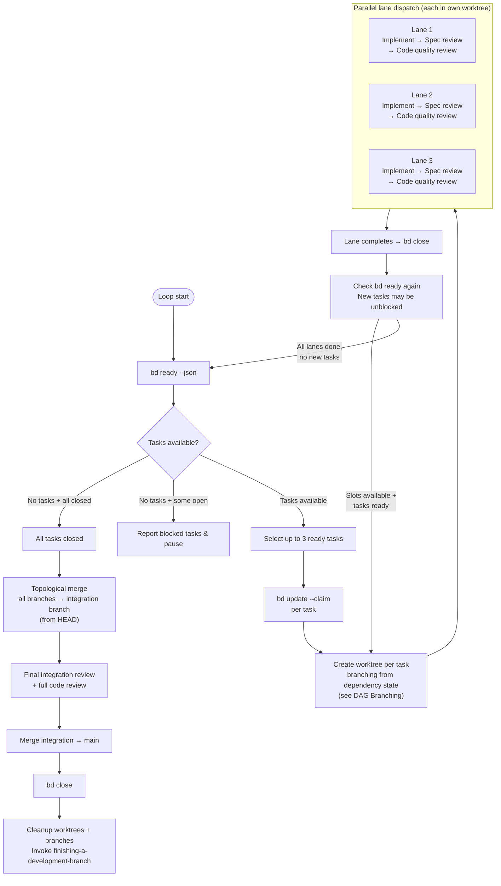
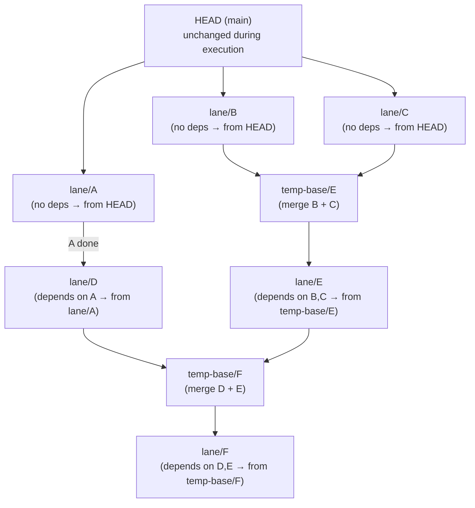
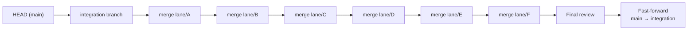
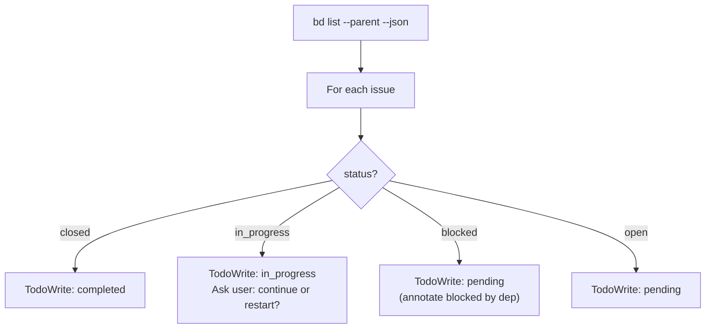

# Design: dispatch-parallel-bead-agents Skill

**Date:** 2026-03-23
**Status:** Draft
**Approach:** New standalone skill alongside existing sequential beads-driven-development

## Problem

beads-driven-development processes tasks one at a time: pick a task, implement, spec review, code quality review, close, repeat. When `bd ready` returns multiple independent tasks, this leaves throughput on the table. The beads dependency graph already identifies which tasks can safely run concurrently.

Running parallel agents in the same worktree is inherently fragile — concurrent git operations race, `git add .` can stage another agent's files, and even non-overlapping file edits share a single index. Git worktrees solve this at the filesystem level: each lane gets its own isolated working directory and branch.

Additionally, the current chunk-based dependency model (all tasks in chunk N+1 depend on ALL tasks in chunk N) was designed for serial execution and is too coarse for parallel work. A fine-grained dependency graph is needed so `bd ready` can release tasks as soon as their actual dependencies complete, not when an entire chunk finishes.

## Design Decisions

1. **Review strategy:** Full pipeline per agent. Each parallel lane runs implement → spec review → code quality review independently.
2. **Isolation:** Each lane gets its own git worktree and branch. No shared working directory, no concurrent git operations on the same index.
3. **Branching model:** DAG-based. Each task's worktree branches from the merge of its specific dependencies' branches — not from main or an integration branch. Maximum parallelism: a task starts as soon as its actual dependencies complete.
4. **Main branch protection:** Main is untouched during execution. All work accumulates in lane branches. A single final merge into main happens only after all tasks complete and pass review.
5. **Parallelism limit:** Fixed cap of 3 concurrent lanes.
6. **Fine-grained dependencies:** The plan-to-beads converter produces per-task dependency edges (explicit annotations, file overlap inference, chunk ordering as fallback) so `bd ready` returns tasks at the earliest possible moment.

## Architecture

### Core Loop



Key difference from wave-based model: **the loop doesn't wait for all lanes to finish before dispatching new ones.** As soon as a lane completes and frees a slot, `bd ready` is checked for newly unblocked tasks. This is a streaming pool model with MAX_LANES concurrent workers.

Graceful degradation: when only 1 task is ready and no parallel slots are needed, skip worktree overhead and run in-place (same as sequential beads-driven-development).

### DAG-Based Worktree Branching

Each task's worktree branches from the state that includes all of its dependencies' completed work. Main is never touched during execution.



**Branching rules:**

| Dependencies | Branch from |
|---|---|
| No deps | HEAD (main) |
| 1 dep | That dep's completed lane branch directly |
| N deps | Temporary merge branch of all dep lane branches |

**Creating a multi-dep base branch:**

```bash
# Task E depends on Task B and Task C
git checkout -b temp-base/E lane/B
git merge lane/C --no-ff -m "Merge deps for Task E (B+C)"
# If conflict: dispatch resolution agent with B and C's task specs
git worktree add <worktree-dir>/lane-E -b lane/E temp-base/E
```

**If the dependency merge conflicts:** Dispatch a conflict resolution agent. The conflict is between two completed, reviewed tasks — the agent has both task specs and the conflict markers. If unresolvable after 3 attempts, escalate to user. This is rare: tasks with conflicting deps usually indicate a dependency edge is missing.

### Final Merge to Main

After all tasks complete, merge everything into main via an integration branch:



1. Create an integration branch from HEAD.
2. Merge each task's lane branch in **topological order** (dependencies before dependents).
   - Since dependent branches already include their deps' changes, git's 3-way merge resolves cleanly: the common ancestor is the branch point, and only the task's own changes are new.
3. Run final integration review on the full diff (integration vs HEAD).
4. If issues found, fix and re-review (max 3 iterations, then escalate).
5. Fast-forward main to integration (or merge if main has diverged).
6. Cleanup: remove all worktrees, lane branches, and temp-base branches.

### Enhanced Plan-to-Beads Converter

The existing converter uses coarse chunk-based dependencies. For parallel execution, fine-grained per-task dependencies are needed so `bd ready` can release tasks at the earliest possible moment.

**Dependency resolution priority:**

1. **Explicit plan annotations** (highest priority, most accurate)
2. **File-based overlap inference** (when no explicit annotation)
3. **Chunk ordering** (fallback — conservative but safe)

#### 1. Explicit Plan Annotations

The plan format supports a `Depends on:` field per task:

```markdown
### Task 5: Implement user dashboard
**Depends on:** Task 2, Task 3
**Files:**
- src/components/Dashboard.tsx
- src/api/dashboard.ts
```

The converter parses these annotations and creates direct `bd dep add` edges. This is the most accurate source because the plan author knows the real dependencies.

The `writing-plans` skill should be made aware of this format so it produces dependency annotations when the plan is intended for parallel execution.

#### 2. File-Based Overlap Inference

When a task has no explicit `Depends on:` field, the converter analyzes `Files:` sections:

- Extract file paths from each task's `Files:` section.
- If task Y lists a file that task X also lists, and X has a lower task number, create a dependency edge: Y depends on X.
- If multiple tasks share files, the one with the lowest task number is treated as the "producer" and all others depend on it.

**Limitations:** File overlap misses non-file dependencies (shared types, API contracts, runtime behavior). But combined with chunk ordering as fallback, it errs on the side of safety.

#### 3. Chunk Ordering Fallback

When a task has no explicit deps AND no file overlap with any prior task, fall back to the existing chunk model:

- Tasks within the same chunk: no dependencies (parallel-safe).
- Tasks in chunk N+1 with no other deps: depend on all tasks in chunk N.

This ensures that even plans written without parallel execution in mind produce a safe (conservative) dependency graph.

#### Converter Validation

After building the dependency graph, the converter:

1. **Cycle detection:** Run `bd dep cycles` after wiring. If cycles found, report and abort.
2. **Orphan detection:** Warn if a task in chunk N+1 has no dependencies at all (possible missing annotation).
3. **Over-connection warning:** Warn if a task depends on more than 50% of all prior tasks (likely chunk fallback — suggest adding explicit annotations).

### Handoff Hook Integration

Add a 4th execution option to `vendor/prompts/execution-options.md`:

```markdown
4. **Parallel beads-driven development** (requires bd CLI)
   Creates an epic + task issues in beads from the plan with fine-grained
   dependency analysis. Dispatches up to 3 tasks in parallel, each in its
   own git worktree. Tasks start as soon as their specific dependencies
   complete. Uses DAG-based branching for isolation, with a single final
   merge to main after all tasks pass review.
   Skill: `super-beads:dispatch-parallel-bead-agents`.
```

When the user chooses this option, the handoff hook:

1. Runs the enhanced converter (with dependency analysis) instead of the basic chunk-based converter.
2. Injects a context message referencing the `dispatch-parallel-bead-agents` skill.
3. Includes the epic ID, task count, and dependency graph summary.

The existing beads-driven option (option 3) continues to use the chunk-based converter.

### Task Spec Provisioning

Before dispatching lanes, the orchestrator resolves each task's full text:

1. Check if the bead ID exists in the task-number-to-bead-id mapping (from plan conversion).
2. **If mapped:** Read the full task spec from the plan file using the task-number reference. Provide the complete text to the lane subagent.
3. **If not mapped (ad-hoc task):** Use the bead description directly as the task spec.

The orchestrator never makes lane subagents read the plan file. All task text is provided inline in the lane prompt.

### Lane Execution

Each lane is dispatched as a single Task subagent that runs the three-stage pipeline linearly within one prompt session. The lane subagent acts as a mini-orchestrator: it implements, then self-reviews against the spec, then reviews code quality — all within a single agent session. This is architecturally different from the sequential skill where the main orchestrator dispatches three separate subagents. Here, collapsing into one agent per lane enables true parallel execution.

The lane prompt provides:
- Full task spec text (from provisioning above)
- Context about where the task fits in the broader plan
- The worktree path where it should work
- The review criteria from `spec-reviewer-prompt.md` and `code-quality-reviewer-prompt.md`
- Instructions to run all three stages sequentially within the session

**NEEDS_CONTEXT handling within lanes:** When the implementer phase encounters ambiguity:
- **Attempt 1-2:** The lane subagent attempts to self-resolve by reading relevant source files, tests, and documentation in the codebase. It has full file system access within its worktree and should use it.
- **Attempt 3:** If still unresolved, the lane returns NEEDS_CONTEXT to the orchestrator with a description of what it needs.
- The orchestrator provides the requested context and re-dispatches the lane (resuming the same task, not starting over).
- If NEEDS_CONTEXT returns 3 times from the orchestrator level, the lane is marked FAILED and escalated to the user.

The lane subagent returns a structured report:
- **Status:** DONE / BLOCKED / FAILED / NEEDS_CONTEXT
- **Files changed:** List of all modified/created files
- **Test results:** Pass/fail summary
- **Review summaries:** Spec review verdict, code quality verdict
- **Concerns:** Any issues noted during implementation or review

If a lane returns BLOCKED, the orchestrator updates the bead (`bd update <id> --status blocked --reason "..."`) and proceeds with remaining lanes. If a lane returns FAILED (review loops exhausted), the orchestrator escalates to the user before continuing.

### Dual Tracking Protocol

Every state transition updates both beads and TodoWrite:

| Event | Beads | TodoWrite |
|---|---|---|
| Task dispatched to lane | `bd update <id> --claim` | Mark in_progress |
| Lane returns BLOCKED | `bd update <id> --status blocked` | Mark pending + reason |
| Lane passes all reviews | `bd close <id>` | Mark completed |
| All tasks closed | (proceed to final merge) | All completed |
| Final merge + review passes | `bd close <epic-id>` | (all already completed) |

If beads and TodoWrite disagree, beads wins. TodoWrite re-syncs from `bd list` periodically.

### Model Selection

Same strategy as beads-driven-development / subagent-driven-development:
- **Cheap/fast models:** Mechanical tasks (isolated functions, clear specs, 1-2 files).
- **Standard models:** Integration tasks (multi-file, pattern matching).
- **Most capable models:** Architecture, design, review tasks, integration review, merge conflict resolution.

## Initialization

Before entering the execution loop, sync session state with beads (same as beads-driven-development):



Additionally:
- Verify the worktree directory is set up (following using-git-worktrees conventions).
- Check for any stale lane worktrees/branches from a previous interrupted session and clean them up.
- Build the dependency graph from beads (`bd dep tree <epic-id>`) to understand branching requirements.

## Error Handling

- **`bd ready` error:** Retry once, then report and pause.
- **`bd close` error:** Log warning, continue (code is done; beads state can be fixed manually).
- **Lane BLOCKED:** Update bead, continue with remaining lanes.
- **Lane FAILED (review exhausted):** Escalate to user with reviewer concerns before proceeding.
- **Dependency merge conflict (creating multi-dep base branch):** Dispatch conflict resolution agent. If unresolvable after 3 attempts, escalate to user. This usually indicates a missing dependency edge.
- **Final topological merge conflict:** Dispatch resolution agent per merge step. Escalate if unresolvable.
- **Lane NEEDS_CONTEXT:** Orchestrator provides requested context and re-dispatches the lane (max 3 round-trips). If still unresolved, lane marked FAILED and escalated to user with full context request history.
- **Worktree creation failure:** Fall back to sequential execution for this task (log warning).
- **Dependency cycle detected during conversion:** Abort conversion, report cycle to user.
- Tracking failures never block code execution. Code failures always stop the lane.
- **Cleanup failures** (worktree removal): Log warning, continue. Stale worktrees can be cleaned manually.

## Red Flags

**Never:**
- Merge anything into main during execution (only at the very end).
- Skip reviews (spec compliance OR code quality) in any lane.
- Skip the final integration review.
- Proceed with unfixed merge or integration issues.
- Dispatch more than MAX_LANES concurrent lanes.
- Make subagents read the plan file (provide full text instead).
- Skip re-review after implementer fixes within a lane.
- Start code quality review before spec compliance passes within a lane.
- Create a task's worktree from HEAD when it has dependencies (must branch from dependency state).
- Run lane subagents in the main worktree when parallel lanes are active.
- Skip dependency cycle validation during conversion.

## Relationship to Existing Skills

- **beads-driven-development:** Sequential sibling. Uses chunk-based converter. Use when tasks are heavily interdependent or when you want simplicity with zero merge overhead.
- **dispatching-parallel-agents:** Inspiration for the parallel dispatch pattern, but that skill is for independent investigations (single-stage). This skill runs full three-stage pipelines per lane.
- **subagent-driven-development:** Shares prompt templates (implementer, spec-reviewer, code-quality-reviewer). This skill doesn't replace it; it uses the same building blocks.
- **using-git-worktrees:** Provides the worktree creation, setup, and verification conventions. This skill follows those conventions for lane isolation.
- **writing-plans:** Should produce `Depends on:` annotations when the user intends parallel execution. The enhanced converter reads these annotations.

## When to Use This Skill vs beads-driven-development

Use **dispatch-parallel-bead-agents** when:
- Multiple tasks are available in `bd ready` (2+).
- Throughput matters more than minimal token usage.
- Project setup is fast enough that worktree overhead is acceptable.
- The plan has tasks that can genuinely run in parallel.

Use **beads-driven-development** (sequential) when:
- Only 1 task is ready at a time.
- Project setup is slow (large `npm install`, long compilation) making worktree overhead prohibitive.
- You want simpler orchestration with no merge step.
- Tasks are tightly coupled and nearly all depend on each other.
